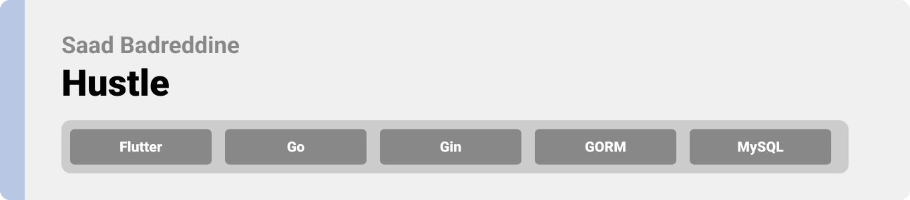
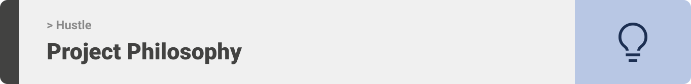
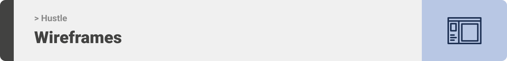
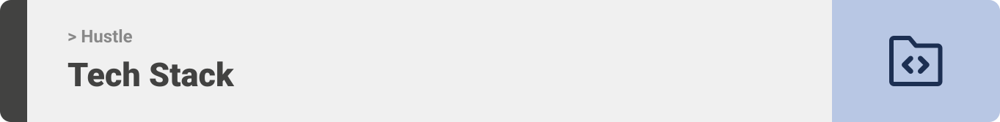
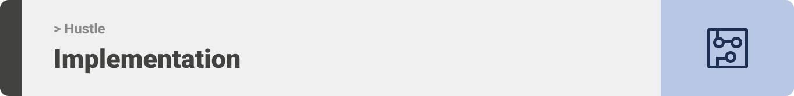

<div align="center">

> Hello world! This is the project’s summary that describes the project plain and simple, limited to the space available.

**[PROJECT PHILOSOPHY](https://github.com/saadbadreddine/sefactory-fsw-final-project/#-project-philosophy) • [WIREFRAMES](https://github.com/saadbadreddine/sefactory-fsw-final-project#-wireframes) • [TECH STACK](https://github.com/saadbadreddine/sefactory-fsw-final-project#-tech-stack) • [IMPLEMENTATION](https://github.com/saadbadreddine/sefactory-fsw-final-project#-impplementation) • [HOW TO RUN?](https://github.com/saadbadreddine/sefactory-fsw-final-project#-how-to-run)**

</div>

<br><br>



> Hustle app is a map based LFG app aimed at sports player struggling to find teams or individuals to play with in the areas that they live in.
>
> Hustle app lets you drop a marker on the map with a sport category of your choosing, the desired time the game will be held, and an announcement message. This marker is then broadcasted and shown to all the users of the app, requests can be sent and once accepted users will be redirected to WhatsApp to plan the game.

### User Stories

- As a user, I want to find 2 basketball players around my area, so that me and my team can have a full court game
- As a user, Karim wants to find a team of basketball planning a game, so that he can join them

<br><br>



> This design was done on Figma for fine details.
> The app follows material guidelines and uses material 3 components which were released alongside Android 12.
> The app also uses Android 12 material you dynamic color feature. A user-generated scheme is derived from a user’s personal wallpaper selection, then Hustle app will reflect color preferences at the individual device level.
> To learn more about material you please visit: https://m3.material.io/styles/color/dynamic-color/overview

| Landing      | Home/Search |
| ------------ | ----------- |
|  |

| Artists results      | Artist's Albums |
| -------------------- | --------------- |
|  |

<br><br>



Here's a brief high-level overview of the tech stack the Well app uses:

- This project uses the [Flutter app development framework](https://flutter.dev/). Flutter is a cross-platform hybrid app development platform which allows us to use a single codebase for apps on mobile, desktop, and the web.

<br><br>


> Uing the above mentioned tecch stacks and the wireframes build with figma from the user sotries we have, the implementation of the app is shown as below, these are screenshots from the real app

| Landing | Home/Search |
| ------- | ----------- |
|    |

<br><br>


> This is an example of how you may give instructions on setting up your project locally.
> To get a local copy up and running follow these simple example steps.

### Prerequisites

This is an example of how to list things you need to use the software and how to install them.

- npm
  ```sh
  npm install npm@latest -g
  ```

### Installation

_Below is an example of how you can instruct your audience on installing and setting up your app. This template doesn't rely on any external dependencies or services._

1. Get a free API Key at [https://example.com](https://example.com)
2. Clone the repo
   ```sh
   git clone https://github.com/your_username_/Project-Name.git
   ```
3. Install NPM packages
   ```sh
   npm install
   ```
4. Enter your API in `config.js`
   ```js
   const API_KEY = "ENTER YOUR API";
   ```
